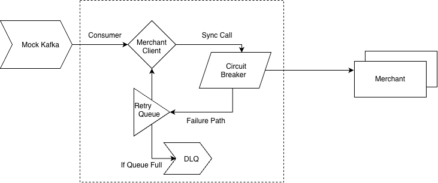

# Payment Notification System

A demonstration of a **synchronous-first payment notification platform** with
asynchronous retry/recovery: payments are confirmed to merchants immediately
on the happy path, and only failures fall back to a scheduled retry system
with per-merchant circuit breakers, exponential backoff, and a dead-letter
queue.

This system starts **after** a payment has already been published to Kafka
(by an upstream "S1" service, out of scope here) and stops **before** any
bank integration. It does not implement S1 or bank integration.

Runs with **zero external infrastructure** — Kafka and the retry queue are
both in-memory, behind interfaces that a real deployment would swap for
actual Kafka and Redis.

---

## Architecture



**C1 and C2 share the same per-merchant `MerchantGuard`** (circuit breaker +
rate limiter + concurrency limiter), via a single `ResilientMerchantClient`
that both paths call. A merchant identified as unhealthy by a synchronous C1
call immediately stops C2 from hammering it too, and vice versa. Guards are
keyed per merchant, so one merchant's outage (e.g. Amazon) never touches
another's (e.g. Flipkart) traffic, rate limit, or circuit breaker state.

### Why synchronous-first?

Payment confirmation is latency-sensitive. The normal path attempts
synchronous delivery (Kafka → S2 → C1 → merchant) and returns/commits
immediately on success. **Retry is the failure path, not the default one** —
only a retryable failure (timeout, connection error, 408/429/5xx) enters the
scheduled retry system. A permanent failure (400/401/403/404) skips retry
entirely and goes straight to the DLQ, since retrying it would never help.

### Backpressure and bounded resources

Nothing in this system is unbounded:

- Mock Kafka partitions are fixed-capacity blocking queues; a producer that
  outpaces a partition's consumer blocks (with visible backpressure stalls),
  it never grows the buffer without limit.
- S2 runs exactly one consumer thread per partition (times a configurable
  replica count) — a fixed pool, not a thread per message.
- The merchant simulator, C2 worker pool, and the shared HTTP client's I/O
  executor are all fixed-size thread pools with bounded work queues.
- Per-merchant concurrency and rate limits cap how many concurrent/QPS calls
  a single merchant can receive from this service, regardless of upstream
  volume.
- The scheduled retry queue and the DLQ are capped (configurable); if the
  retry queue is ever full, new retries fall back to the DLQ rather than
  growing memory without bound.
- Bounded recent-history ring buffers back the dashboard's live feed — no
  event is written to a database.

### Why one merchant's failure can't block Kafka consumption

Kafka partitions are assigned to independent consumer threads (S2), so a
slow/failing merchant only ever stalls the partition(s) carrying its
traffic — other partitions (and the merchants whose events land there) keep
flowing. Within an affected partition, two things bound how long a bad
merchant can hold up that thread:

1. Every merchant HTTP call has a configured request timeout.
2. Once the circuit breaker for that merchant opens, **no HTTP call is even
   attempted** — the call fails fast in-process and the notification is
   handed straight to the retry queue.

---

## How the mock infrastructure maps to production

| In this demo | Interface | Production replacement |
|---|---|---|
| `MockKafkaEventSource` (in-memory, partitioned, bounded) | `EventSource` | A real `KafkaEventSource` wrapping `KafkaConsumer`, same partitioning/offset/commit semantics |
| `InMemoryScheduledQueue` (priority queue by `nextAttemptAt`) | `ScheduledMessageQueue` | Redis, with `nextAttemptAt` as a ZSET score (`ZADD`/`ZRANGEBYSCORE`/`ZREM`) |
| `MerchantSimulatorServer` (embedded JDK `HttpServer`, in-process) | — (it *is* the HTTP boundary) | The real merchant's webhook/notification endpoint |
| In-memory `MetricsRegistry` / bounded history | — | A real metrics backend (Prometheus/Micrometer) and a proper event store, if durable history were required |

Both interfaces (`EventSource`, `ScheduledMessageQueue`) are the seams this
codebase was designed around: swapping either implementation requires no
changes to S2, C1, C2, the circuit breaker, or the retry scheduler.

---

## Project layout

```
src/main/java/com/paymentnotify/
  domain/       Immutable event/record types (PaymentEvent, RetryMessage, DeliveryResult, ...)
  ingestion/    Mock Kafka (partitions, offsets, backpressure) + configurable traffic generator
  s2/           S2 Kafka consumer (bounded, one thread per partition)
  delivery/     C1 synchronous delivery, MerchantClient (HTTP + resilient decorator), failure classification
  merchant/     Merchant simulator (embedded HTTP server) + runtime-configurable failure injection
  resilience/   Per-merchant circuit breaker, rate limiter, concurrency limiter
  retry/        Scheduled retry queue, exponential backoff + jitter, retry scheduler
  c2/           C2 retry worker pool
  dlq/          Dead-letter store
  metrics/      Lightweight in-memory metrics + the service that assembles dashboard/API views
  api/          REST controllers
  config/       All app.* configuration properties (see application.yml)
src/main/resources/
  static/       Dashboard (index.html / app.js / style.css — plain HTML/CSS/JS, no build step)
  application.yml
```

---

## Running it

### Option 1 — Docker Compose (no local Java needed)

```bash
docker compose up --build
```

Then open **http://localhost:8080** for the dashboard.

### Option 2 — locally with Maven

Requires JDK 21.

```bash
./mvnw spring-boot:run
```

Then open **http://localhost:8080**.

No Kafka, Redis, or any other external service is required in either case —
the mock Kafka producer/broker and the in-memory retry queue start inside
the same JVM.

### Running the tests

```bash
./mvnw test
```

---

## Using the dashboard

The dashboard (a single static page, polling the REST API every 2s) has six
sections:

1. **System Overview** — ingestion/processing/delivery rates, success rate,
   retry rate, DLQ count, scheduled queue depth, consumer lag, active C2
   workers.
2. **Traffic Generator** — set events/sec, an optional duration, and which
   merchants to target, then Start/Stop synthetic traffic.
3. **Merchant Health** — per-merchant status, request rate, success/failure
   rate, latency, circuit breaker state, and active/limit concurrency.
4. **Failure Injection** — per merchant: success / 4xx / 429 / 500 / 503 /
   timeout, a failure percentage, and injected latency. Changes apply
   immediately to the next request the merchant simulator receives.
5. **Retry Queue** — pending messages: payment ID, merchant, attempt number,
   next attempt time, last failure reason.
6. **Dead Letter Queue** — event ID, payment ID, merchant, attempts made,
   failure reason, when it was moved.

A **Recent Notifications** feed at the bottom shows the last ~30 delivery
attempts (C1 or C2) across all merchants, for a live view of the pipeline.

### A 60-second demo script

1. Start traffic: 200 events/sec, no duration limit, all merchants.
2. Watch **System Overview** — ingestion/processing/delivery rates climb,
   success rate at 100%, retry rate at 0. This is the normal path: every
   payment is confirmed synchronously by C1.
3. In **Failure Injection**, set one merchant (e.g. `amazon`) to `HTTP_503`
   at 100% failure. Apply.
4. Watch that merchant's row in **Merchant Health**: failure rate jumps,
   then its circuit breaker flips `CLOSED → OPEN` (a handful of failures is
   enough, per the configured threshold). **Retry Queue** starts filling
   with `amazon` entries. Other merchants are untouched.
5. Set `amazon` back to `SUCCESS`. After the configured open-wait, its
   circuit breaker goes `OPEN → HALF_OPEN → CLOSED`, and the **Retry
   Queue** drains as C2 successfully redelivers the backlog. DLQ count for
   `amazon` stays at 0 (it recovered inside the retry budget).
6. To see a DLQ entry, set a merchant to `HTTP_4XX` (e.g. 404) at 100% — a
   permanent failure skips retry entirely and lands in the DLQ on the very
   first (C1) attempt.

---

## REST API

All under `/api`:

| Endpoint | Purpose |
|---|---|
| `GET /api/metrics/system` | System-wide rates/counts (ingestion, processing, delivery, retry, DLQ, queue depth, consumer lag, active workers) |
| `GET /api/metrics/history` | Bounded recent notification history |
| `GET /api/merchants` | Known merchant IDs |
| `GET /api/merchants/health` | Per-merchant health (status, rates, latency, circuit breaker, concurrency) |
| `GET /api/merchants/{id}/failure-injection` | Current failure-injection config for a merchant |
| `PUT /api/merchants/{id}/failure-injection` | Update it (mode, failure %, latency, 4xx code) |
| `GET /api/merchants/circuit-breakers` | Circuit breaker state for every merchant |
| `POST /api/traffic/start` | Start the synthetic traffic generator (`eventsPerSecond`, `durationSeconds`, `merchantIds`) |
| `POST /api/traffic/stop` | Stop it |
| `GET /api/traffic/status` | Current generator status |
| `GET /api/retry-queue` | Pending retry messages, ordered by next attempt time |
| `GET /api/dlq` | Dead-letter entries |
| `GET /api/dlq/merchants/{id}` | Dead-letter entries for one merchant |

---

## Configuration

Everything demo-relevant lives under `app.*` in `application.yml` — nothing
is hardcoded. Highlights:

```yaml
app:
  kafka:
    partition-count: 8
    partition-buffer-capacity: 2000     # per-partition bound (backpressure)
  retry:
    max-attempts: 6
    base-delay-ms: 5000
    backoff-multiplier: 4.5             # exponential backoff
    max-delay-ms: 7200000               # cap (2h)
    jitter-ratio: 0.2                   # +/-20% jitter, avoids retry storms
  circuit-breaker:
    failure-rate-threshold: 0.5
    sliding-window-size: 20
    minimum-calls: 10
    open-state-wait-ms: 15000
    half-open-permitted-calls: 5
  concurrency:
    c2-worker-pool-size: 32
    per-merchant-max-concurrency: 10
  rate-limit:
    per-merchant-permits-per-second: 200
  failure-classification:
    retryable-status-codes: [408, 429]  # plus any 5xx, always retryable
    permanent-status-codes: [400, 401, 403, 404]
```

---

## Scale: the 100K events/sec target

The mock Kafka pipeline (partitioned producer → bounded per-partition
queues → per-partition consumers) is designed to sustain the target
ingestion rate of **100,000 synthetic events/sec** — it's pure in-memory
object creation and queueing, so a single producer thread pacing itself
against that target is enough to demonstrate it (see `TrafficGenerator`).

That is **not** a claim that a developer laptop can sustain 100,000 *real
external HTTP requests/sec* to merchants — no single machine reasonably
can, and this demo doesn't pretend otherwise. What's actually bounded and
realistic here is the **merchant-facing side**: fixed-size C2 worker pools,
per-merchant concurrency/rate limits, and a real (loopback) HTTP client with
configured timeouts and connection pooling. The architecture — partitioned
ingestion, independent per-partition consumers, bounded worker pools per
downstream dependency — is exactly the shape that scales horizontally (more
partitions, more consumer instances, more C2 workers) in a real deployment;
this demo just runs it all in one process, at laptop scale, on the
merchant-calling side.

**Measured locally** (32 partitions, 1ms simulated merchant latency, single
machine): `POST /api/traffic/start {"eventsPerSecond": 100000, "durationSeconds": 5}`
sustained **~85,000–93,000 events/sec actually published** into the mock
Kafka broker over the run (499,900 of the requested 500,000 events — the
producer's own pacing loop, not an external dependency, so it tracks the
target closely). Downstream, the 8 S2 partition consumers making real
(loopback) synchronous HTTP calls drained that backlog at their honest
achievable rate — a five-figure consumer lag briefly built up and then
fully drained to 0 with **100% success and 0 DLQ**, exactly the "Kafka as
durable buffer, backpressure instead of unbounded growth" behavior this
design targets. Dropping merchant latency to something realistic (tens of
milliseconds) or capping partitions/threads to a small default — as this
project ships with — trades peak ingestion rate for a laptop-friendly
default; both are the same code path, just different `app.kafka.*` /
`app.concurrency.*` values.

---

## Design decisions and trade-offs worth knowing about

- **HTTP client model**: `HttpMerchantClient` uses `HttpClient.send()`
  (blocking from the caller's point of view) rather than fully chained
  `sendAsync()` futures. The underlying `java.net.http.HttpClient` still
  does non-blocking, connection-pooled I/O; what blocks is the *bounded*
  calling thread (one of a handful of S2 partition consumers or C2 workers)
  — never a per-request thread. This keeps the delivery path linear and
  easy to read while staying within the "no thread-per-request" constraint.
- **Circuit breaker granularity**: one breaker per merchant, shared by C1
  and C2 through a single `ResilientMerchantClient` bean. There is
  deliberately no global breaker — one merchant's outage must never affect
  another's traffic.
- **Retry-to-same-queue**: C2 failures don't get a separate "C2 queue" —
  they reschedule onto the exact same `ScheduledMessageQueue`, just with an
  incremented attempt count and the next backoff delay. This is what makes
  the queue implementation swappable (Redis ZSET) without C1/C2 needing to
  know which "generation" of retry they're handling.
- **No internal de-duplication**: Kafka's at-least-once guarantee means a
  merchant may legitimately be notified more than once for the same
  `paymentId`/`eventId`. This system does not suppress duplicates itself —
  it sends a stable `Idempotency-Key` (the `eventId`) so a real receiver
  can dedupe, matching how idempotent webhook delivery is normally handled.
- **Merchant simulator as one process**: for the demo, every merchant is
  served by the same embedded HTTP server (routed by path), instead of one
  process per merchant. That's a demo shortcut — the resilience code
  (timeouts, circuit breakers, rate/concurrency limits) still treats each
  merchant as fully independent, and swapping in real, separately-hosted
  merchant endpoints requires no code changes (just different URLs from
  `MerchantEndpointResolver`).

## What's intentionally out of scope

- S1 (publishing payment events to Kafka) — this system assumes that already happened.
- Bank integration.
- Exactly-once HTTP delivery (not achievable over HTTP; at-least-once + idempotency key is the realistic contract).
- A durable event store / relational database — metrics and history are bounded, in-memory, and reset on restart.
