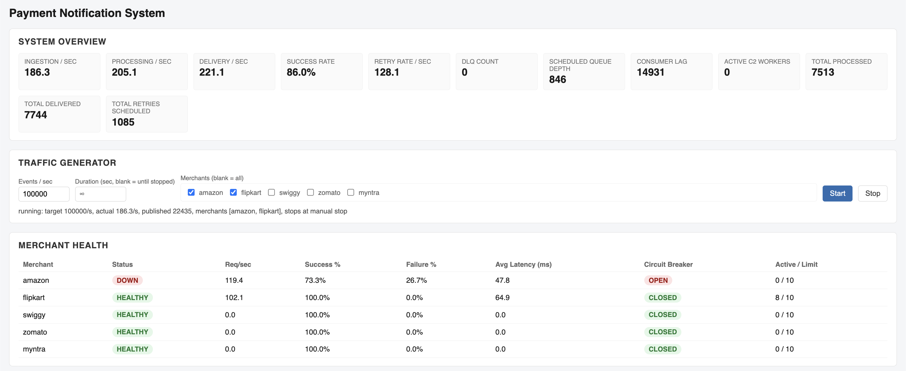

# Payment Notification System — Execution & Feature Guide

This is the step-by-step operational companion to `README.md`. It walks
through every component from a fresh clone to a live dashboard, and for
every tunable parameter it tells you **what to change, how to change it,
and what you should observe** as a result.

Two categories of "tweak" appear throughout this guide:

- **Live, via API/UI** — takes effect on the next request, no restart
  needed (traffic generation, failure injection).
- **Static, via `application.yml`** — read once at startup
  (`@ConfigurationProperties`, no `@RefreshScope`); changing it requires
  **restarting the application**. Each such section says so explicitly.

---

## Table of Contents

1. [Prerequisites](#1-prerequisites)
2. [Clone the repository](#2-clone-the-repository)
3. [Running the application](#3-running-the-application)
4. [Verifying it's up](#4-verifying-its-up)
5. [Opening the dashboard](#5-opening-the-dashboard)
6. [Component reference — what each piece does and how to exercise it](#6-component-reference)
7. [Tweaking parameters — steps and expected results](#7-tweaking-parameters--steps-and-expected-results)
8. [Full REST API reference](#8-full-rest-api-reference)
9. [Running the automated test suite](#9-running-the-automated-test-suite)
10. [End-to-end demo script](#10-end-to-end-demo-script)
11. [Troubleshooting](#11-troubleshooting)
12. [Cleanup](#12-cleanup)

---

## 1. Prerequisites

Choose **one** of the two run paths below; you don't need both.

| Run path | Requirements |
|---|---|
| Docker Compose (recommended, zero local Java setup) | Docker Desktop / Docker Engine with Compose v2 (`docker compose version`) |
| Local Maven | JDK 21 on your `PATH` (or `JAVA_HOME` pointed at one). No Maven install needed — the repo ships `./mvnw`. |

Nothing else is required. There is **no Kafka, Redis, or database to
install** — the mock Kafka broker and the in-memory retry queue start
inside the same JVM as the app.

Check what you have:

```bash
docker compose version   # for the Docker path
java -version             # for the local path — must report 21.x
```

If you don't have JDK 21 and don't want Docker, install one, e.g. on macOS:

```bash
brew install openjdk@21
export JAVA_HOME=/opt/homebrew/opt/openjdk@21/libexec/openjdk.jdk/Contents/Home
export PATH="$JAVA_HOME/bin:$PATH"
```

---

## 2. Clone the repository

```bash
git clone <repository-url> payment-notification-system
cd payment-notification-system
```

Take a quick look at what's here:

```bash
ls
# AGENTS.md  Dockerfile  IMPLEMENTATION_PLAN.md  README.md  RUNBOOK.md
# docker-compose.yml  mvnw  mvnw.cmd  pom.xml  src/
```

- `src/main/java/com/paymentnotify/` — all application code, organized by
  pipeline stage (`ingestion`, `s2`, `delivery`, `merchant`, `resilience`,
  `retry`, `c2`, `dlq`, `metrics`, `api`, `config`, `domain`).
- `src/main/resources/application.yml` — every tunable parameter.
- `src/main/resources/static/` — the dashboard (`index.html`, `app.js`, `style.css`).
- `src/test/java/...` — 59 tests, unit + integration.

---

## 3. Running the application

### Option A — Docker Compose

```bash
docker compose up --build
```

First run builds the image (compiles the project inside a throwaway Maven
container, then packages a slim JRE 21 runtime image) — expect this to take
one to a few minutes depending on network speed, since it downloads
dependencies fresh inside the container. Subsequent runs are fast (Docker
layer caching).

**Expected output** (tail of the log): a Spring Boot banner, then lines
like:

```
... MockKafkaBroker            : MockKafkaBroker started: 8 partitions, 2000 capacity each
... C2WorkerPool                : C2WorkerPool started: 32 workers
... MerchantSimulatorServer     : Merchant simulator listening on port 8099 (200 worker threads)
... RetryScheduler              : RetryScheduler started: polling every 200ms, batch size 200
... S2Consumer                  : S2Consumer started: 8 partitions, 1 thread(s) each (8 total)
... TomcatWebServer             : Tomcat started on port 8080 (http) with context path '/'
... PaymentNotificationApplication : Started PaymentNotificationApplication in ~1s
```

Run it in the background instead with `docker compose up -d --build`, and
follow logs with `docker compose logs -f`.

### Option B — Local Maven

```bash
./mvnw spring-boot:run
```

(Windows: `mvnw.cmd spring-boot:run`)

Same startup log as above. Stop with `Ctrl+C`.

To run with **overridden settings** without touching `application.yml`,
pass them as command-line arguments — useful for the tuning experiments in
section 7:

```bash
./mvnw spring-boot:run -Dspring-boot.run.arguments="--app.kafka.partition-count=16 --app.retry.max-attempts=3"
```

or, if running the packaged jar directly:

```bash
./mvnw -q -DskipTests package
java -jar target/payment-notification-service.jar --app.kafka.partition-count=16
```

---

## 4. Verifying it's up

```bash
curl -s http://localhost:8080/actuator/health
# {"status":"UP"}

curl -s http://localhost:8080/api/merchants
# ["amazon","flipkart","swiggy","zomato","myntra"]
```

If both return successfully, every component (mock Kafka, S2, the merchant
simulator, the retry scheduler, C2, the API layer) started correctly — they
all initialize eagerly at boot, so a healthy `/actuator/health` means the
whole pipeline is live.

---

## 5. Opening the dashboard

Open **http://localhost:8080** in a browser. It's a single static page
(no login, no build step) that polls the REST API every 2 seconds. Six
sections, top to bottom:

| Section | What it shows |
|---|---|
| **System Overview** | Ingestion / processing / delivery rate, success rate, retry rate, DLQ count, scheduled queue depth, consumer lag, active C2 workers, running totals |
| **Traffic Generator** | Controls: events/sec, optional duration, merchant checkboxes, Start/Stop, live status line |
| **Merchant Health** | Per merchant: status badge, request rate, success/failure %, avg latency, circuit breaker badge, active/limit concurrency |
| **Failure Injection** | Per merchant: mode dropdown, failure %, latency (ms), 4xx code, Apply button |
| **Retry Queue** | Pending messages: payment ID, merchant, attempt number, next attempt time, last failure |
| **Dead Letter Queue** | Event ID, payment ID, merchant, attempts made, failure reason, moved-at time |

A **Recent Notifications** feed at the very bottom shows the last ~30
delivery attempts (C1 or C2) across all merchants — useful to watch the
pipeline move in real time.

Nothing here needs configuration to start working: as soon as the page
loads, every section populates from the live API (even with zero traffic
running, Merchant Health shows all 5 default merchants as `HEALTHY`/`CLOSED`
with zero request rate).

---

## 6. Component reference

What each piece is, and the quickest way to see it working in isolation.

### 6.1 Mock Kafka (ingestion)

`MockKafkaBroker` + `MockKafkaEventSource` — partitions events by hashing
`paymentId` (so every event for one payment lands on the same partition,
preserving order), assigns monotonically increasing offsets per partition,
and bounds each partition to a fixed-capacity queue.

**See it work**: start the Traffic Generator (section 7.1) and watch
**Consumer Lag** in System Overview rise when you push a rate the
downstream can't keep up with, then fall back to 0 as S2 drains it. That
rise-then-drain *is* backpressure, working as designed — not a bug.

### 6.2 S2 consumer

`S2Consumer` — one dedicated thread per Kafka partition (8 by default),
polling in a loop, calling C1 synchronously, then committing the offset.

**See it work**: `app.concurrency.s2-consumer-threads-per-partition` and
`app.kafka.partition-count` together set the total consumer thread count,
logged at startup (`S2Consumer started: N partitions, M thread(s) each`).

### 6.3 C1 synchronous delivery

`C1DeliveryService` — the normal path. Called inline by S2 for every
message; on success, nothing else happens (that's the point — payment
confirmation should be immediate). On a retryable failure it hands off to
the retry queue; on a permanent failure (or if the retry queue is full) it
goes straight to the DLQ.

**See it work**: with default (healthy) merchants, **Recent Notifications**
shows a stream of `source: C1`, `success: true` rows the moment you start
traffic.

### 6.4 Merchant simulator

`MerchantSimulatorServer` — one embedded HTTP server (JDK's built-in
`HttpServer`, no servlet container) on port `8099`, routing
`POST /merchants/{id}/notify` by path. Behavior per merchant is entirely
driven by `MerchantSimulatorConfigService`, mutated live by the
Failure Injection API/UI.

**See it work**: `curl -X POST http://localhost:8099/merchants/amazon/notify -d '{}'` returns `200 {"status":"accepted"}` by default.

### 6.5 Resilience layer

`resilience/` — `CircuitBreaker`, `RateLimiter`, `MerchantGuard` (bundles
both plus a concurrency semaphore), all keyed per merchant in
`MerchantGuardRegistry`. `ResilientMerchantClient` is the single gate C1
*and* C2 both call through, which is what makes their circuit-breaker state
shared.

**See it work**: section 7.2 and 7.3 below.

### 6.6 Scheduled retry queue + backoff/jitter

`retry/` — `InMemoryScheduledQueue` (time-ordered, capacity-bounded),
`BackoffPolicy` (exponential + jitter), `RetryScheduler` (one thread
polling for due messages).

**See it work**: the **Retry Queue** dashboard section, or
`GET /api/retry-queue`, shows every pending message's exact
`nextAttemptAt` — watch the delay grow between successive failures of the
same message (attempt 1 due in seconds, attempt 2 further out, etc.).

### 6.7 C2 retry workers

`c2/C2WorkerPool` — a fixed-size pool (32 workers by default) that executes
due retries through the *same* `ResilientMerchantClient` as C1. A retryable
failure reschedules the same message (incremented attempt, same queue); a
permanent failure or exhausted attempts routes to the DLQ.

**See it work**: **active C2 Workers** in System Overview rises above 0
while retries are actively in flight.

### 6.8 DLQ

`dlq/DeadLetterStore` — capped in-memory store for anything that will never
succeed.

**See it work**: inject a 100%-permanent failure (`HTTP_4XX`) on a
merchant that's receiving traffic — entries appear in **Dead Letter Queue**
on the very first attempt (permanent failures skip retry entirely).

### 6.9 Metrics & observability

`metrics/MetricsRegistry` + `MetricsService` — lightweight in-memory
counters and a bounded recent-history ring buffer, assembled into the DTOs
the dashboard/API consume. Nothing here is written to a database.

---

## Sreenshot for the service in Action : 


## 7. Tweaking parameters — steps and expected results

### 7.1 Traffic Generator (live — dashboard or API)

| Field | What it controls |
|---|---|
| Events/sec | Target sustained publish rate into mock Kafka |
| Duration (sec) | Auto-stop after this long; blank = runs until you click Stop |
| Merchants | Which merchants receive the generated traffic (round-robin/random); none selected = all known merchants |

**Steps (dashboard)**: set `Events / sec` to `200`, leave duration blank,
leave merchants unchecked (= all), click **Start**.

**Steps (API)**:
```bash
curl -X POST http://localhost:8080/api/traffic/start \
  -H 'Content-Type: application/json' \
  -d '{"eventsPerSecond": 200, "durationSeconds": null, "merchantIds": []}'
```

**Expected result**: within ~2s, System Overview's *Ingestion/sec*,
*Processing/sec* and *Delivery/sec* all climb toward ~200, *Success Rate*
sits at 100%, *Retry Rate* and *DLQ Count* stay at 0. Merchant Health shows
non-zero request rates spread across all 5 merchants. Stop it:

```bash
curl -X POST http://localhost:8080/api/traffic/stop
```
Rates decay back toward 0 over the next couple of polling windows (rates
are a trailing average, not instantaneous).

**Try this variation**: push the rate far beyond what a single merchant's
concurrency/rate limits allow (e.g. `eventsPerSecond: 5000` targeting one
merchant only). **Expected result**: that merchant's `Req/sec` in Merchant
Health plateaus near its configured limit (`per-merchant-max-concurrency` /
`per-merchant-permits-per-second`, defaults 10 concurrent / 200 per sec)
rather than climbing indefinitely — excess attempts come back as
`rate_limited` / `concurrency_limit_reached` retryable outcomes and cycle
through the retry queue rather than being dropped.

### 7.2 Failure injection (live — dashboard or API)

Per merchant, in the **Failure Injection** panel:

| Field | Values | Effect |
|---|---|---|
| Mode | `SUCCESS`, `HTTP_4XX`, `HTTP_429`, `HTTP_500`, `HTTP_503`, `TIMEOUT` | What the simulator returns when the failure roll hits |
| Failure % | 0–100 | Chance any given request is failed with `Mode` instead of succeeding |
| Latency (ms) | any non-negative integer | Added to *every* request (success or failure) before responding |
| 4xx code | e.g. 400/401/403/404 | Only used when Mode = `HTTP_4XX` |

#### 7.2.1 Transient failure → circuit opens → recovers

**Steps**: with traffic already running (7.1), set `amazon` to
Mode=`HTTP_503`, Failure %=`100`, Latency=`20`, click Apply.

```bash
curl -X PUT http://localhost:8080/api/merchants/amazon/failure-injection \
  -H 'Content-Type: application/json' \
  -d '{"mode":"HTTP_503","failurePercentage":100,"latencyMs":20,"specific4xxStatus":400}'
```

**Expected result, in order**:
1. `amazon`'s row in Merchant Health: `Failure %` jumps toward 100%.
2. Within a handful of failed calls (default: after at least
   `minimum-calls`=10 calls, once failure rate ≥ `failure-rate-threshold`=0.5),
   `amazon`'s **Circuit Breaker** badge flips `CLOSED → OPEN`, and **Status**
   flips to `DOWN`.
3. **Retry Queue** starts accumulating `amazon` entries — each with
   `attempt: 1` and a `nextAttemptAt` a few seconds out.
4. **No other merchant is affected** — check `flipkart`/`swiggy`/etc. in
   Merchant Health: still `HEALTHY`/`CLOSED`, unchanged request/success rates.
5. While OPEN, no real HTTP calls reach `amazon` at all — every C1/C2
   attempt fails instantly with `circuit_open` (visible as the failure
   detail on retry-queue/history entries), so a genuinely down merchant
   can't keep consuming worker time.

**Steps — recovery**: set `amazon` back to healthy:
```bash
curl -X PUT http://localhost:8080/api/merchants/amazon/failure-injection \
  -H 'Content-Type: application/json' \
  -d '{"mode":"SUCCESS","failurePercentage":0,"latencyMs":20,"specific4xxStatus":400}'
```

**Expected result**: after `open-state-wait-ms` (default 15s), the breaker
flips `OPEN → HALF_OPEN` on the next attempt; that trial call now succeeds
against the healthy merchant, and after `half-open-permitted-calls`
consecutive successes (default 5), it flips `HALF_OPEN → CLOSED`. The
**Retry Queue** entries for `amazon` drain to 0 as C2 successfully
redelivers the backlog. **DLQ stays at 0** for `amazon` — it recovered
within the retry budget (default `max-attempts`=6).

#### 7.2.2 Permanent failure → straight to DLQ, no retry

**Steps**: with traffic targeting `flipkart`, set Mode=`HTTP_4XX`,
Failure %=`100`, 4xx code=`404`.

```bash
curl -X PUT http://localhost:8080/api/merchants/flipkart/failure-injection \
  -H 'Content-Type: application/json' \
  -d '{"mode":"HTTP_4XX","failurePercentage":100,"latencyMs":5,"specific4xxStatus":404}'
```

**Expected result**: entries appear in **Dead Letter Queue** almost
immediately, each with `attemptsMade: 1` and `failureReason: "HTTP 404"` —
they never touch the Retry Queue at all, because 400/401/403/404 are
classified as permanent (not worth retrying). `flipkart`'s circuit breaker
*does* still open (permanent failures still count against it) but its
retry queue stays empty for these events.

#### 7.2.3 Timeout

**Steps**: Mode=`TIMEOUT`, Failure %=`100`.

**Expected result**: calls to that merchant take until the client's
request timeout (default 2000ms, `app.http-client.request-timeout-ms`)
before failing — visibly higher latency in Merchant Health's `Avg Latency`
column, and the failure is classified retryable (timeout), so it follows
the same retry path as an HTTP 503.

#### 7.2.4 Latency without failure

**Steps**: Mode=`SUCCESS`, Failure %=`0`, Latency=`800`.

**Expected result**: `Avg Latency` for that merchant rises to ~800ms+;
success rate stays 100%; no circuit breaker or retry activity at all —
latency alone (below the request timeout) never trips anything.

#### 7.2.5 Partial failure percentage

**Steps**: Mode=`HTTP_500`, Failure %=`30`.

**Expected result**: roughly 30% of that merchant's requests fail and 70%
succeed (statistically, over enough volume); whether the circuit breaker
opens depends on whether that rate clears `failure-rate-threshold` (default
0.5) — at 30% it typically **stays CLOSED**, so you can use this to
demonstrate a degraded-but-not-tripped merchant, with a steady trickle of
messages going through the retry path and mostly succeeding on redelivery.

### 7.3 Circuit breaker tuning (static — `application.yml`, **restart required**)

```yaml
app:
  circuit-breaker:
    failure-rate-threshold: 0.5      # fraction of window that must fail to trip OPEN
    sliding-window-size: 20          # how many recent calls the failure rate is computed over
    minimum-calls: 10                # don't evaluate failure rate below this many calls
    open-state-wait-ms: 15000        # how long OPEN lasts before trying HALF_OPEN
    half-open-permitted-calls: 5     # consecutive trial successes needed to fully close
```

| Change | Expected effect |
|---|---|
| Lower `minimum-calls` (e.g. `2`) | Circuit trips open much faster — visible after just 2 failed calls instead of 10. Good for fast demos. |
| Lower `open-state-wait-ms` (e.g. `2000`) | Recovery cycle (OPEN → HALF_OPEN → CLOSED) completes in ~2s instead of 15s. |
| Raise `failure-rate-threshold` (e.g. `0.9`) | Merchant has to be almost entirely failing before the breaker trips — a 30–50% failure-percentage injection (7.2.5) will no longer open it. |
| Raise `half-open-permitted-calls` (e.g. `20`) | Takes 20 consecutive successful trial calls to fully close after recovery — a flapping/still-somewhat-unhealthy merchant is more likely to fall back to OPEN before it fully recovers. |

**How to apply and see it**: edit `application.yml` (or pass
`--app.circuit-breaker.open-state-wait-ms=2000` etc. as a run argument),
restart, then repeat 7.2.1 — the timings you observe should match the new
values.

### 7.4 Retry / backoff tuning (static — `application.yml`, **restart required**)

```yaml
app:
  retry:
    max-attempts: 6           # retries before DLQ (not counting the original C1 attempt)
    base-delay-ms: 5000       # attempt 1's delay
    backoff-multiplier: 4.5   # delay(n) = base * multiplier^(n-1), capped at max-delay-ms
    max-delay-ms: 7200000     # hard cap (2 hours)
    jitter-ratio: 0.2         # +/-20% randomization on every computed delay
    queue-capacity: 200000    # hard cap on pending retries; beyond it, new retries go to DLQ instead
    poll-batch-size: 200      # how many due messages RetryScheduler pulls per poll
    poll-interval-ms: 200     # how often RetryScheduler polls for due messages
```

With defaults, successive attempt delays are approximately:
`5s → 22.5s → 1.7min → 7.6min → 34min → capped at 2h`.

| Change | Expected effect |
|---|---|
| `max-attempts: 2` | A merchant that never recovers reaches the DLQ much sooner — 2 retries instead of 6 — with `attemptsMade: 3` on the DLQ entry (original C1 attempt + 2 retries). |
| `base-delay-ms: 200`, `backoff-multiplier: 2.0` | Retries become fast enough to watch live: attempt 1 in ~200ms, attempt 2 in ~400ms, attempt 3 in ~800ms — this is exactly what the integration tests use to keep test runtime short. |
| `jitter-ratio: 0` | `nextAttemptAt` values in the Retry Queue become perfectly deterministic (no randomness) — useful for verifying the exact backoff curve; in production this risks a "retry storm" where many failures synchronize onto the same retry instant. |
| `queue-capacity: 1` | With more than one message needing retry at once, the second one overflows straight to the DLQ with reason `retry_queue_full` — demonstrates the bounded-queue safety valve. |

### 7.5 Concurrency & rate limits (static — `application.yml`, **restart required**)

```yaml
app:
  concurrency:
    s2-consumer-threads-per-partition: 1   # S2 threads = partition-count * this
    c2-worker-pool-size: 32                # total C2 retry workers (fixed pool)
    per-merchant-max-concurrency: 10       # concurrent in-flight calls allowed to one merchant
  rate-limit:
    per-merchant-permits-per-second: 200   # token-bucket rate cap per merchant
```

| Change | Expected effect |
|---|---|
| `per-merchant-max-concurrency: 2` | Even with heavy traffic to one merchant, its `Active Requests` in Merchant Health never exceeds `2 / 2`; the rest queue up as retryable `concurrency_limit_reached` failures and cycle through the retry queue. |
| `per-merchant-permits-per-second: 5` | That merchant's sustained `Req/sec` plateaus near 5, regardless of how much traffic is generated toward it. |
| `c2-worker-pool-size: 2` | With many simultaneous retries due, `Active C2 Workers` in System Overview caps at 2; the rest of the due messages simply wait slightly longer to be picked up on the next scheduler poll (no message is lost — a saturated pool re-queues rather than blocking or dropping). |

### 7.6 Kafka partitioning & backpressure (static — `application.yml`, **restart required**)

```yaml
app:
  kafka:
    partition-count: 8
    partition-buffer-capacity: 2000
```

| Change | Expected effect |
|---|---|
| `partition-count: 32` | 32 independent S2 consumer threads instead of 8 — higher achievable aggregate throughput, since a slow merchant only ever blocks the partition(s) carrying its traffic. |
| `partition-buffer-capacity: 50` | Backpressure kicks in almost immediately under any real traffic load — watch **Consumer Lag** and the achieved `Ingestion/sec` (vs. requested) diverge sharply once the small buffer fills, since the producer now blocks on nearly every publish until a partition drains. |
| `partition-count: 1` | Every payment funnels through a single consumer thread — a slow/failing merchant on that one partition now visibly stalls *all* traffic, letting you directly observe the isolation property this system is designed to avoid in the default (8-partition) configuration. |

**Ordering guarantee, unaffected by any of the above**: all events for the
same `paymentId` always hash to the same partition, so changing partition
count changes *parallelism*, never per-payment ordering.

---

## 8. Full REST API reference

Base URL: `http://localhost:8080`

| Method | Path | Body | Returns |
|---|---|---|---|
| GET | `/actuator/health` | — | `{"status":"UP"}` |
| GET | `/api/metrics/system` | — | System-wide rates/counts (see below) |
| GET | `/api/metrics/history` | — | Last ~500 delivery attempts (bounded ring buffer) |
| GET | `/api/merchants` | — | `["amazon","flipkart",...]` |
| GET | `/api/merchants/health` | — | Array of per-merchant health objects |
| GET | `/api/merchants/{id}/health` | — | One merchant's health object |
| GET | `/api/merchants/{id}/failure-injection` | — | Current failure-injection config |
| PUT | `/api/merchants/{id}/failure-injection` | `{"mode","failurePercentage","latencyMs","specific4xxStatus"}` | Updated config |
| GET | `/api/merchants/circuit-breakers` | — | Array of `{merchantId, state, currentFailureRate}` |
| GET | `/api/merchants/{id}/circuit-breaker` | — | One merchant's circuit breaker status |
| POST | `/api/traffic/start` | `{"eventsPerSecond","durationSeconds","merchantIds"}` | Generator status |
| POST | `/api/traffic/stop` | — | Generator status |
| GET | `/api/traffic/status` | — | Generator status |
| GET | `/api/retry-queue` | — | Array of pending `RetryMessage`, sorted by `nextAttemptAt` |
| GET | `/api/retry-queue/size` | — | Integer |
| GET | `/api/dlq` | — | Array of `DeadLetterEntry` |
| GET | `/api/dlq/merchants/{id}` | — | DLQ entries for one merchant |
| GET | `/api/dlq/count` | — | Lifetime DLQ count (even beyond the bounded in-memory view) |

**Example — system metrics response**:
```json
{
  "ingestionPerSecond": 168.0,
  "processingPerSecond": 165.5,
  "deliveryPerSecond": 161.0,
  "successRatePercent": 100.0,
  "retryRatePerSecond": 0.0,
  "dlqTotalCount": 0,
  "dlqCurrentSize": 0,
  "scheduledQueueDepth": 0,
  "consumerLagTotal": 0,
  "activeC2Workers": 0,
  "totalProcessed": 400,
  "totalDelivered": 395,
  "totalRetryScheduled": 0
}
```

**Example — merchant health response**:
```json
{
  "merchantId": "amazon",
  "status": "DOWN",
  "requestRatePerSecond": 92.75,
  "successRatePercent": 88.27,
  "failureRatePercent": 11.72,
  "averageLatencyMs": 24.27,
  "circuitBreakerState": "OPEN",
  "activeRequests": 0,
  "concurrencyLimit": 10,
  "failureInjection": {"mode": "HTTP_503", "failurePercentage": 100, "latencyMs": 10, "specific4xxStatus": 400}
}
```

Note: `merchantId` inside `RetryMessage`/`DeadLetterEntry` payloads is
serialized as a nested object, `{"value": "amazon"}`, not a bare string —
that's the `MerchantId` record's JSON shape.

---

## 9. Running the automated test suite

```bash
./mvnw test
```

**Expected result**: `Tests run: 59, Failures: 0, Errors: 0, Skipped: 0`,
`BUILD SUCCESS`. Coverage includes: successful C1 delivery, C1 failure →
retry, C2 success removes retry, C2 failure reschedules the same message,
exponential backoff, jitter, circuit breaker open/half-open/recovery,
merchant isolation, retry-limit → DLQ, payment ordering, bounded
concurrency, backpressure, and duplicate/idempotent event handling — plus
two full multi-component integration tests
(`FailureRecoveryIntegrationTest`) that wire up the real pipeline
end-to-end (no mocks) with fast timings.

Run a single test class:
```bash
./mvnw test -Dtest=FailureRecoveryIntegrationTest
```

---

## 10. End-to-end demo script

A complete run-through, ~2 minutes:

1. Start the app (section 3). Confirm health (section 4). Open the
   dashboard (section 5).
2. Start traffic: 300 events/sec, no duration, all merchants.
   **Expect**: rates climb, 100% success, 0 retries/DLQ.
3. Set `amazon` to `HTTP_503` @ 100% failure.
   **Expect**: `amazon` fails, circuit opens (~10 calls in), other
   merchants unaffected, retry queue fills with `amazon` entries.
4. Set `amazon` back to `SUCCESS`.
   **Expect**: after ~15s, circuit half-opens then closes; retry queue
   drains to 0 for `amazon`; DLQ stays at 0.
5. Set `flipkart` to `HTTP_4XX` (404) @ 100% failure.
   **Expect**: DLQ fills immediately with `flipkart` entries,
   `attemptsMade: 1` — no retry queue activity for these.
6. Stop traffic. **Expect**: rates decay to 0; queue/DLQ contents remain
   visible (nothing is cleared on stop).
7. `curl http://localhost:8080/api/metrics/system` and
   `curl http://localhost:8080/api/dlq` to confirm the same story via the
   raw API.

---

## 11. Troubleshooting

| Symptom | Likely cause / fix |
|---|---|
| `Unable to access jarfile target/...jar` | You need to `./mvnw -DskipTests package` before running the jar directly (not needed for `spring-boot:run` or Docker). |
| Port 8080 already in use | Another instance is running — check `lsof -i :8080` / stop the other process, or override with `--server.port=8081`. |
| Port 8099 already in use | The merchant simulator's fixed port collided with another instance (including a leftover test run). Stop it, or override `--app.merchant-simulator.port=8199`. |
| Docker build is slow the first time | Expected — it downloads the JDK base images and all Maven dependencies fresh inside the build container. Subsequent builds are cached. |
| Circuit breaker never opens despite 100% failure injection | You likely haven't sent `minimum-calls` (default 10) worth of traffic to that merchant yet — start/keep the traffic generator running toward it. |
| Retry queue never drains after recovery | Give it `open-state-wait-ms` (default 15s) plus a few retry cycles; also confirm you set failure injection back to `SUCCESS`, not just lowered the failure %. |
| `docker compose up` shows the container as unhealthy | Give it `start_period` (15s in the compose healthcheck) to boot before it's marked unhealthy; check `docker compose logs` for a real startup error if it persists. |

---

## 12. Cleanup

**Docker**:
```bash
docker compose down          # stop and remove the container + network
docker compose down --rmi local   # also remove the built image
```

**Local**: `Ctrl+C` the running `spring-boot:run` process, or
`kill <pid>` if started with `java -jar ... &`.

All state (metrics, retry queue, DLQ, traffic generator config, failure
injection settings) is in-memory only — stopping the process discards it.
There is nothing on disk to clean up beyond the `target/` build directory
(`./mvnw clean` removes that).
