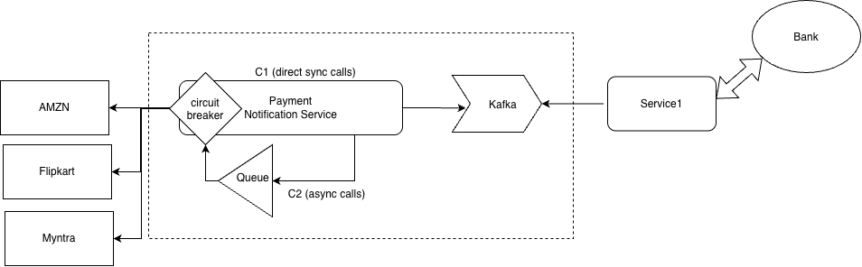

# Service Architetcure 

This is not for agentic code development. This is for humans, for the core architecture of the MVP for the Payment Service Notification. 

AI Agents should not read this file. 

The architecture for the payment notification, as discussed : 

Considerations : 

The notification-service starts with a kafka record being put by the Service1 (other service) into kafka, with the payment status. 

Infra managed by the service
* Kafka 
* Queue 
* payment-notification-service